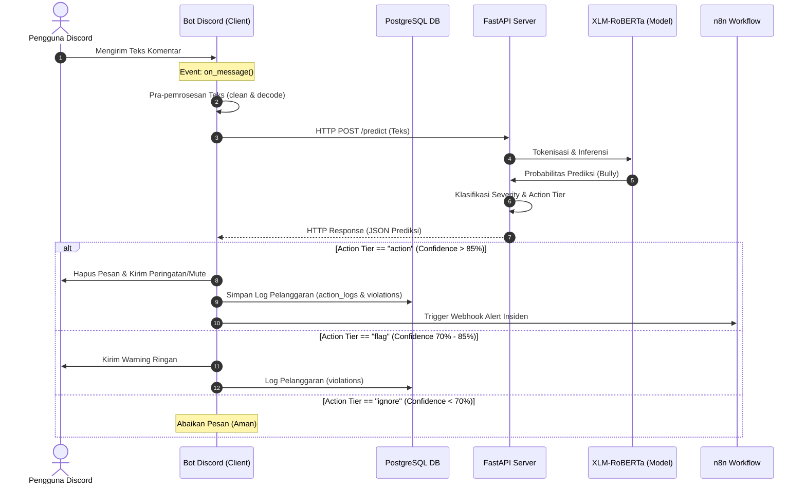
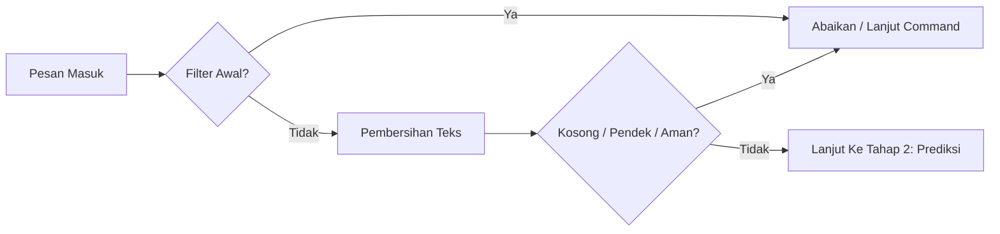
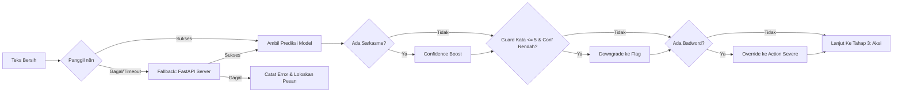
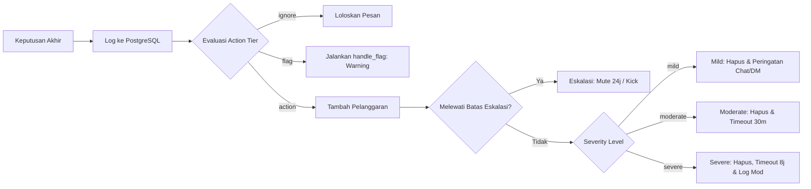
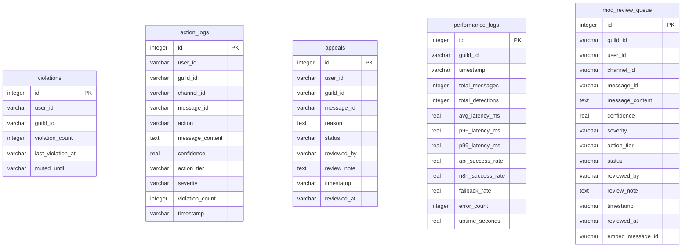

# CRISP-DM: Tahap Deployment (Penyebaran)

Tahap **Deployment** (Penyebaran/Penerapan) merupakan fase akhir dalam siklus hidup CRISP-DM di mana hasil penelitian berupa model klasifikasi terbaik yang telah dilatih dan dievaluasi diintegrasikan ke dalam infrastruktur nyata. Pada proyek **Sistem Deteksi Cyberbullying** bilingual ini, deployment dirancang menggunakan arsitektur **Client-Server** yang modular, aman, responsif, dan terotomatisasi secara penuh untuk melindungi server komunitas dari perundungan siber secara *real-time*.

Berikut adalah dokumentasi arsitektur sistem, skema endpoint API, alur bot Discord, skema database PostgreSQL, otomatisasi n8n, kontainerisasi Docker, serta potongan kode implementasi teknis tahap Deployment:

---

## 🌐 1. Arsitektur Sistem Hulu ke Hilir (*End-to-End System Architecture*)

Sistem deteksi dirancang menggunakan empat komponen utama yang saling berinteraksi:
1.  **FastAPI Inference Server (Server)**: Menyediakan layanan web API untuk melayani inferensi model XLM-RoBERTa (fine-tuned) berlatensi rendah.
2.  **Discord Bot Client (Klien)**: Aplikasi bertipe *event-driven* yang memantau obrolan teks, melakukan pra-pemrosesan teks, memanggil API prediksi, dan mengeksekusi tindakan moderasi otomatis.
3.  **PostgreSQL Database (Penyimpanan)**: Layanan database relasional terpusat yang berjalan di dalam kontainer Docker untuk menyimpan data akumulasi pelanggaran pengguna, log audit moderasi, data banding (*appeal*), antrian review moderator, dan log performa sistem.
4.  **n8n Workflow Automation (Otomatisasi)**: Orkestrator otomatis untuk mengirimkan pemberitahuan insiden tingkat tinggi ke administrator dan memfasilitasi peninjauan ajuan banding.

### Diagram Alur Data Sistem (Mermaid Diagram)


---

## ⚡ 2. FastAPI Inference Server (*Inference Service*)

Layanan API dibangun menggunakan framework **FastAPI** dan dijalankan lewat ASGI server **Uvicorn** di port `8000`. API ini memuat model XLM-RoBERTa sekali pada saat *startup* menggunakan fungsi lifespan async, lalu melayani HTTP requests secara konkuren.

### A. Endpoint Utama API:
*   `GET /health`: Mengecek status kesehatan server, status model, dan konfigurasi ambang batas (*threshold*).
*   `POST /predict`: Melakukan inferensi pada satu teks komentar.
*   `POST /predict/batch`: Melakukan inferensi secara paralel pada sekumpulan teks (maksimum 32 teks) untuk meningkatkan throughput pemrosesan.
*   `GET /metrics/snapshot`: Menyediakan snapshot indikator performa sistem bot teraktual untuk diintegrasikan ke dashboard pemantauan luar (seperti n8n).

### B. Aturan Klasifikasi Tingkat Bahaya (*Severity*) & Tingkat Aksi (*Action Tiers*):
Setiap hasil prediksi teks dikategorikan secara dinamis berdasarkan ambang batas probabilitas kelas *Bully* (`confidence_bully`):

| Probabilitas (*Confidence*) | Tingkat Bahaya (*Severity*) | Tingkat Aksi (*Action Tier*) | Tindakan Moderasi Bot |
| :---: | :---: | :---: | :--- |
| **< 70%** | `non_bullying` | `ignore` | Pesan diabaikan (dianggap aman/normal). |
| **70% - 80%** | `mild` | `flag` | Pesan tetap tayang. Kirim peringatan ringan ke user, tambah 1 pelanggaran ke DB. |
| **80% - 92%** | `moderate` | `flag` / `action` | Kirim peringatan keras, log pelanggaran, beri status *warning flag* untuk ditinjau moderator. |
| **> 92%** | `severe` | `action` | Hapus pesan secara otomatis, hapus riwayat instan, dan beri hukuman *Mute/Timeout* ke pengguna. |

### C. Potongan Kode Implementasi API (`api/main.py`)
```python
@app.post("/predict", response_model=PredictionResponse, tags=["Prediction"])
async def predict(request: PredictRequest):
    # Memastikan model prediktor telah dimuat secara aman di memori
    ensure_model_loaded()

    t0 = time.perf_counter()
    # Mengeksekusi inferensi model XLM-RoBERTa
    result = predictor.predict(request.text)
    elapsed_ms = round((time.perf_counter() - t0) * 1000, 2)

    logger.info(
        f"Predict -> Text: '{request.text[:30]}...' | "
        f"Label: {result['label']} | Confidence: {result['confidence']:.4f} | "
        f"Tier: {result['action_tier']} | Severity: {result['severity']} | "
        f"Time: {elapsed_ms}ms"
    )

    # Mengembalikan response Pydantic JSON
    return PredictionResponse(
        text=request.text,
        label=result["label"],
        label_id=result["label_id"],
        confidence=round(result["confidence"], 4),
        confidence_bully=round(result["confidence_bully"], 4),
        confidence_non_bully=round(result["confidence_non_bully"], 4),
        action_tier=result["action_tier"],
        severity=result["severity"],
        processing_time_ms=elapsed_ms
    )
```

**Penjelasan Kode**:
*   **Fungsi `predict`**: Endpoint POST yang menerima payload JSON sesuai schema [PredictRequest](file:///c:/Users/JOEWIN/Project/Cyberbullying%20Detection/api/main.py#L148).
*   **Baris `ensure_model_loaded`**: Melakukan pencegahan error dengan memeriksa ketersediaan objek `predictor`. Jika model gagal dimuat pada fase startup, FastAPI akan mengembalikan HTTP Error 503 (Service Unavailable).
*   **Baris `predictor.predict(request.text)`**: Memanggil pustaka inferensi internal yang membagi teks ke tokenizer XLM-RoBERTa, melakukan feedforward ke model klasifikasi PyTorch, dan memetakan output probabilitas logits menjadi biner.
*   **Penyusunan Response**: Menghitung waktu pemrosesan inferensi (`elapsed_ms`) untuk memantau latensi pemrosesan dan mengemas seluruh informasi prediksi (nilai probabilitas per-kelas, action tier, severity) ke objek schema [PredictionResponse](file:///c:/Users/JOEWIN/Project/Cyberbullying%20Detection/api/main.py#L165).

---

## 🤖 3. Client Application: Bot Discord (*Real-Time Moderation Client*)

Aplikasi klien berupa Bot Discord dibangun menggunakan pustaka **`discord.py`**. Bot berjalan sebagai daemon proses asinkron yang menangkap peristiwa (*event listener*) masuk secara real-time.

### Alur Kerja Moderasi Real-Time Bot:

#### Tahap 1: Penerimaan Pesan & Penyaringan Awal (Intake & Filtering)


#### Tahap 2: Prediksi Model & False Positive Guard (Inference & Guards)


#### Tahap 3: Log & Eksekusi Tindakan (Log & Action Execution)


### Penjelasan Detil Langkah Moderasi:
1.  **Filter Awal (`on_message`)**: Bot menyaring pesan masuk. Pesan akan diabaikan jika dikirim oleh bot lain, dikirim lewat DM, deteksi di server sedang dinonaktifkan, atau diawali dengan prefix perintah bot (`!`, `/`, `.`).
2.  **Pra-pemrosesan Teks (`preprocessor.py`)**: Teks dibersihkan dari user mentions, link URL, dan karakter aneh. Jika setelah dibersihkan teksnya kosong, terlalu pendek (<= 1 kata & < 10 karakter), atau terdeteksi aman tanpa badword (`is_likely_safe`), pesan diloloskan.
3.  **Prediksi Model (n8n Webhook / FastAPI)**: Bot mengirim teks ke n8n. Jika n8n gagal merespons, bot menggunakan mekanisme *fallback* dengan menembak API FastAPI server secara langsung. Hasil klasifikasi berupa label, confidence score, severity, dan action tier akan diterima bot.
4.  **Confidence Boost & Guard**:
    *   **Boost (Sarkasme)**: Jika terdeteksi sinyal sarkasme atau penggunaan tanda baca berlebih, nilai confidence akan dinaikkan untuk mengantisipasi sindiran yang kasar.
    *   **Guard (Pesan Pendek)**: Jika kalimat sangat pendek (<= 3 kata atau <= 5 kata) namun confidence kurang dari ambang batas aman (97% / 92%), tindakan diturunkan (*downgrade*) dari `action` (penghapusan) menjadi `flag` (peringatan) demi menghindari kesalahan sensor (*false positive*).
    *   **Badword Override**: Jika kata kasar terdaftar ditemukan, status langsung dipaksa menjadi `severe` / `action` tanpa mempedulikan output model.
5.  **Log & Eksekusi Tindakan**:
    *   Setiap tindakan dicatat ke database **PostgreSQL** (`db.log_action()`).
    *   Jika masuk kategori **`flag`**, bot memproses warning ringan.
    *   Jika masuk kategori **`action`**, poin pelanggaran ditambahkan ke database. Jika poin kumulatif melanggar aturan eskalasi (misal 3x pelanggaran), bot menerapkan hukuman eskalasi (mute 24 jam / kick). Jika pelanggaran normal, hukuman disesuaikan tingkat keparahannya (`handle_mild`, `handle_moderate`, atau `handle_severe`).

### Potongan Kode Penanganan Pesan Bot (`discord_bot/bot.py`)
```python
@bot.event
async def on_message(message: discord.Message):
    """Main listener: periksa setiap pesan untuk cyberbullying."""
    # 1. Penyaringan Awal (Abaikan Bot, DM, atau Server Non-aktif)
    if Config.IGNORE_BOTS and message.author.bot:
        return
    if not message.guild:
        return

    # 2. Pra-pemrosesan Teks (Pembersihan mentions, URLs, dll)
    prep = preprocess(message.content.strip())
    if prep.is_empty:
        return
    cleaned_text = prep.text

    # 3. Request Prediksi (n8n Webhook / Fallback ke FastAPI)
    result = await call_n8n(cleaned_text, message.author.id, message.guild.id, message.id)
    if result is None:
        result = await call_api_direct(cleaned_text)

    if result is None:
        return

    label = result.get("label", "non-bully")
    confidence = float(result.get("confidence_bully", 0.0))
    tier = result.get("action_tier", "ignore")
    severity = result.get("severity", "non_bullying")

    # 4. Badword Override
    if contains_badword(cleaned_text):
        tier = "action"
        severity = "severe"

    # 5. Pencatatan Audit Trail ke PostgreSQL
    db.log_action(
        user_id=message.author.id,
        guild_id=message.guild.id,
        action=f"detected_{tier}",
        message_content=message.content[:500],
        confidence=confidence,
        action_tier=tier,
        severity=severity,
        channel_id=message.channel.id,
        message_id=message.id,
    )

    # 6. Eksekusi Tindakan Moderasi
    if tier == "ignore":
        return
    elif tier == "flag":
        await handle_flag(message, confidence, severity)
    elif tier == "action":
        violation_count = db.increment_violation(message.author.id, message.guild.id)
        if severity == "mild":
            await handle_mild(message, confidence, severity, violation_count)
        elif severity == "moderate":
            await handle_moderate(message, confidence, severity, violation_count)
        elif severity == "severe":
            await handle_severe(message, confidence, severity, violation_count)
```

**Penjelasan Kode**:
*   **Decorator `@bot.event` & Fungsi `on_message`**: Event listener asinkron utama dari `discord.py` yang mendengarkan setiap pesan obrolan masuk di server Discord secara konkuren.
*   **Pemanggilan `call_n8n` / `call_api_direct`**: Menggunakan HTTP request non-blocking asinkron via `aiohttp`. Pendekatan ini krusial agar event loop utama bot tidak terblokir (*non-blocking*) sehingga bot tetap responsif dalam memproses pesan ribuan pengguna lain secara paralel.
*   **`db.log_action`**: Menyimpan riwayat log deteksi sistem secara persisten ke database PostgreSQL untuk keperluan audit trail admin.
*   **`db.increment_violation`**: Memanggil database PostgreSQL untuk menambah akumulasi jumlah pelanggaran pengguna secara *real-time*. Jika batas hukuman server terlampaui, sistem bot akan memicu penalti tingkat lanjut (timeout/mute panjang).
*   **Fungsi `handle_*`**: Penangan moderasi asinkron (mild, moderate, severe) yang bertugas menghapus pesan melanggar secara instan (`message.delete()`), mengirim rich embed peringatan di chat, mengirim notifikasi lewat DM ke pengguna, dan menerapkan *Timeout* otomatis pada server Discord.

---

## 🗄️ 4. Skema Penyimpanan Data (*PostgreSQL Database Schema*)

Untuk menyimpan data transaksional moderasi bot, digunakan database **PostgreSQL** (`cyberbully_db`). Skema database terdiri atas lima tabel utama yang saling berelasi:



### Penjelasan Fungsional Tabel Database:
1.  **Tabel `violations`**: Menyimpan akumulasi poin pelanggaran per-pengguna per-server. Kolom `violation_count` bertindak sebagai dasar logika penentuan hukuman berulang. Kolom `muted_until` menyimpan penanda batas waktu hukuman bisu (*mute*).
2.  **Tabel `action_logs`**: Menyimpan riwayat log audit untuk setiap tindakan moderasi yang dilakukan bot (seperti penghapusan teks, pemblokiran, peringatan). Tabel ini sangat krusial untuk keperluan peninjauan laporan (*audit trail*) bagi administrator server.
3.  **Tabel `appeals`**: Menyimpan permohonan banding dari pengguna yang merasa terkena salah deteksi (*False Positive*). Banding yang diajukan oleh pengguna lewat tombol interaktif Discord disimpan di sini untuk ditinjau oleh administrator server.
4.  **Tabel `performance_logs`**: Menyimpan catatan statistik performa sistem bot (rata-rata latensi, persentil latensi P95, success rate API, success rate n8n) secara berkala untuk keperluan monitoring stabilitas server.
5.  **Tabel `mod_review_queue`**: Menyimpan antrian pesan yang masuk kategori klasifikasi peninjauan manual moderator (pada *action tier* `flag` atau saat keyakinan model berada di batas ambang tertentu). Menyimpan status review, moderator yang mereview, dan catatan review.

---

## 🔄 5. Otomatisasi Alur Kerja (*n8n Webhook & Workflows*)

    Infrastruktur otomatisasi dibangun menggunakan platform **n8n self-hosted** yang berjalan pada port `5678`. Proyek ini menyediakan dua berkas alur kerja utama di folder `n8n/`:

    ### Alur Kerja n8n Utama:
    1.  **Middleware Inferensi Model (`n8n/workflow_cyberbully.json`)**:
        *   **Fungsi**: Berperan sebagai jembatan *real-time* deteksi. Bot mengirim data pesan obrolan ke Webhook n8n, n8n meneruskan payload tersebut ke FastAPI `/predict`, dan mengembalikan response Pydantic JSON ke bot.
        *   **Skalabilitas**: Dengan menggunakan n8n sebagai jembatan, administrator dapat dengan mudah memperluas alur ini (misalnya menambahkan node untuk meneruskan pesan berstatus `severe` ke Slack/Telegram) tanpa harus mengubah kode Python di bot Discord.
    2.  **Kolektor Metrik Bot (`n8n/workflow_bot_metrics.json`)**:
        *   **Fungsi**: Berjalan secara berkala (cron job setiap 30 menit) atau *on-demand* untuk mengambil snapshot indikator performa sistem dari API FastAPI (`GET /metrics/snapshot`). Alur ini memeriksa kesegaran data dan memformat metrik latensi serta reliabilitas bot untuk pemantauan stabilitas.

---

> [!NOTE]
> **Manajemen Ajuan Banding (Appeals)**:
> Berbeda dengan alur otomatisasi di atas, sistem ajuan banding pada bot Anda ditangani **secara lokal oleh Bot Discord** menggunakan fitur tombol interaktif Discord (`AppealReviewView`). Hal ini dipilih agar moderator server dapat langsung menyetujui atau menolak banding di dalam aplikasi Discord secara instan dan responsif, tanpa perlu membuka dashboard n8n eksternal.

---

## 🐳 6. Infrastruktur Kontainerisasi (*Dockerization & Containerization*)

Seluruh sistem diisolasi ke dalam container Docker untuk mempermudah replikasi lingkungan produksi.

### A. Berkas `Dockerfile` (Inference Service)
Inference API dibungkus menggunakan basis citra Python minimalis `python:3.10-slim`.
*   **Penyusunan Lapisan (*Layer Optimization*)**: Pemasangan pustaka pendukung C++ (`build-essential`) untuk kompilasi modul Python, diikuti penyalinan `requirements.txt` dan instalasi dependensi model (PyTorch, Transformers, FastAPI, Uvicorn) dengan menonaktifkan cache guna mereduksi ukuran citra Docker.
*   **Penyalinan Kode**: Direktori `src/` dan `api/` disalin, lalu variabel lingkungan `PYTHONPATH` diatur ke direktori `/app`.

### B. Berkas Orkestrasi `docker-compose.yml`
Docker Compose digunakan untuk mendefinisikan dan menjalankan layanan kontainer secara bersamaan:

```yaml
services:

  # ── PostgreSQL Database ──────────────────────────────────
  db:
    image: postgres:15-alpine
    container_name: cyberbully_db
    restart: unless-stopped
    ports:
      - "5432:5432"
    environment:
      - POSTGRES_USER=${POSTGRES_USER:-postgres}
      - POSTGRES_PASSWORD=${POSTGRES_PASSWORD:-cyberbully_secure_pwd}
      - POSTGRES_DB=${POSTGRES_DB:-cyberbully_db}
    volumes:
      - postgres_data:/var/lib/postgresql/data
    networks:
      - cyberbully_net

  # ── FastAPI Inference Server ─────────────────────────────
  api:
    build:
      context: .
      dockerfile: Dockerfile
    container_name: cyberbully_api
    restart: unless-stopped
    depends_on:
      - db
    ports:
      - "8000:8000"
    environment:
      - API_PORT=8000
      - API_HOST=0.0.0.0
      - MODEL_PATH=/app/models/xlmr_cyberbully/best_model
      - POSTGRES_HOST=db
      - POSTGRES_PORT=5432
      - POSTGRES_DB=${POSTGRES_DB:-cyberbully_db}
      - POSTGRES_USER=${POSTGRES_USER:-postgres}
      - POSTGRES_PASSWORD=${POSTGRES_PASSWORD:-cyberbully_secure_pwd}
    volumes:
      - ./models:/app/models
      - ./configs:/app/configs
      - .env:/app/.env
    networks:
      - cyberbully_net

  # ── n8n Self-Hosted ──────────────────────────────────────
  n8n:
    image: n8nio/n8n:latest
    container_name: cyberbully_n8n
    restart: unless-stopped
    ports:
      - "5678:5678"
    environment:
      - N8N_HOST=localhost
      - N8N_PORT=5678
      - N8N_PROTOCOL=http
      - WEBHOOK_URL=http://localhost:5678/
      - GENERIC_TIMEZONE=Asia/Jakarta
    volumes:
      - ./n8n/data:/home/node/.n8n
    networks:
      - cyberbully_net

volumes:
  postgres_data:

networks:
  cyberbully_net:
    driver: bridge
```

### C. Langkah Menjalankan Sistem (*Deployment Commands*):
Untuk menyebarkan dan menjalankan sistem di server produksi, Anda hanya perlu menjalankan instruksi command shell berikut pada root direktori proyek:

```bash
# 1. Jalankan seluruh kontainer API dan n8n di latar belakang (background mode)
docker compose up -d

# 2. Jalankan bot Discord asinkron sebagai daemon di server
python -m discord_bot.bot
```

---

## 🏁 Kesimpulan Tahap Deployment
Dengan terintegrasinya seluruh komponen sistem—mulai dari FastAPI Inference Server untuk inferensi model XLM-RoBERTa, daemon asinkron Bot Discord sebagai klien moderasi real-time, database PostgreSQL cyberbully_db sebagai basis log audit, orkestrasi otomatisasi webhook n8n, hingga kontainerisasi Docker—seluruh siklus hidup metodologi **CRISP-DM** untuk proyek **Sistem Deteksi Cyberbullying** ini telah berhasil diselesaikan secara utuh, siap beroperasi di lingkungan server komunitas yang sesungguhnya.
