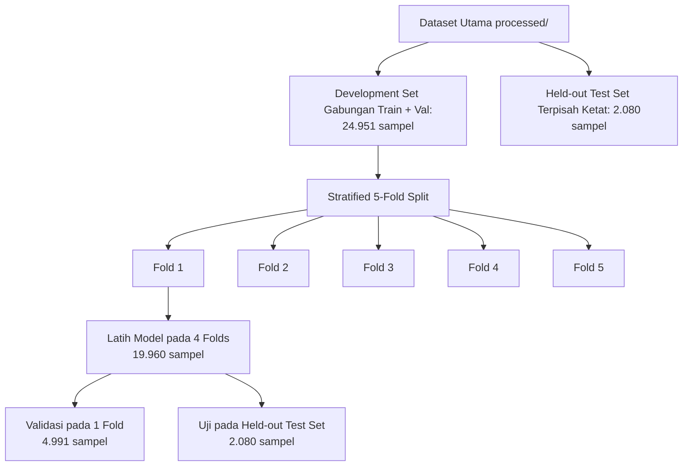

# CRISP-DM: Tahap Modeling (Pemodelan)

Tahap **Modeling** (Pemodelan) merupakan fase di mana berbagai teknik klasifikasi dipilih dan diterapkan pada dataset yang telah dipersiapkan, serta parameternya dioptimalkan untuk mencapai performa deteksi terbaik. Pada proyek **Sistem Deteksi Cyberbullying** bilingual ini, pemodelan dirancang untuk membandingkan performa algoritma pembelajaran mesin tradisional (*traditional machine learning*) dengan model berbasis pembelajaran mendalam (*deep learning*) berarsitektur *Transformer* mutakhir yang dikombinasikan dengan teknik validasi silang yang ketat untuk menjamin keandalan model.

Berikut adalah dokumentasi teknis, penjelasan metodologi, potongan kode (*code snippets*), serta hasil analisis pemodelan yang diimplementasikan pada sistem:

---

## 🛠️ 1. Pemilihan Teknik Pemodelan (*Select Modeling Technique*)

Penelitian ini membandingkan empat variasi teknik pemodelan klasifikasi biner (`1` = *Bully*, `0` = *Non-Bully*) dengan karakteristik representasi fitur yang berbeda:

1. **Naive Bayes (MultinomialNB) — Baseline**:
   * **Fitur**: *TF-IDF Vectorizer* (Term Frequency-Inverse Document Frequency) tingkat kata dan bigram.
   * **Deskripsi**: Algoritma probabilistik berbasis Teorema Bayes dengan asumsi independensi fitur yang kuat. Multinomial Naive Bayes digunakan sebagai model acuan (*baseline*) karena sifatnya yang efisien secara komputasi dan sangat cepat untuk dataset teks skala besar.

2. **Support Vector Machine (SVM) Linear**:
   * **Fitur**: *TF-IDF Vectorizer* tingkat kata dan bigram.
   * **Deskripsi**: SVM bekerja dengan mencari *hyperplane* terbaik yang memisahkan kelas positif (*bully*) dan negatif (*non-bully*) dengan margin maksimal. Penelitian ini menerapkan kernel linear yang dibungkus dengan *CalibratedClassifierCV* untuk melakukan kalibrasi probabilitas keluaran model (mendukung analisis ambang batas keyakinan/*threshold tuning*).

3. **Cosine Similarity (Centroid-based)**:
   * **Fitur**: *Mean-pooled Embeddings* dari *XLM-RoBERTa* (tanpa *fine-tuning*).
   * **Deskripsi**: Menggunakan model representasi bahasa pra-latih *XLM-RoBERTa* untuk mengekstraksi vektor representasi semantik dari teks komentar. Model menghitung titik pusat (*centroid*) untuk masing-masing kelas *Bully* dan *Non-Bully* pada data latih. Prediksi teks baru ditentukan berdasarkan nilai kemiripan kosinus (*cosine similarity*) tertinggi terhadap salah satu dari kedua *centroid* kelas tersebut.

4. **XLM-RoBERTa (Fine-Tuned) — Model Utama**:
   * **Fitur**: Representasi kontekstual berbasis arsitektur *Transformer* multilingual.
   * **Deskripsi**: Melakukan penalaan halus (*fine-tuning*) pada seluruh parameter model `xlm-roberta-base` menggunakan lapisan klasifikasi linier di atas token klasifikasi utama (`<s>` atau token CLS). XLM-RoBERTa dipilih karena kemampuannya menangani struktur kalimat bilingual (Indonesia dan Inggris), toleran terhadap pencampuran bahasa (*code-mixed*), serta peka terhadap konteks semantik kata yang bervariasi secara multilingual.

> [!WARNING]  
> **Catatan Optimasi Komputasi (SVM RBF Skipped)**:  
> Penelitian ini awalnya merencanakan penggunaan **SVM dengan kernel RBF (Radial Basis Function)** menggunakan fitur embedding XLM-RoBERTa. Namun, karena skala dataset pengembangan (*development set*) melampaui **10.000 sampel** (tepatnya **24.951 sampel**), pelatihan SVM RBF membutuhkan memori dan waktu komputasi yang sangat masif karena kompleksitas waktu pelatihan kuadratik $O(N^2)$ hingga kubik $O(N^3)$. Demi efisiensi komputasi, algoritma SVM RBF dilewati (*skipped*) secara otomatis dari pipeline pengujian.

---

## 📐 2. Desain Pengujian & Validasi Silang (*Stratified 5-Fold Cross-Validation*)

Untuk mengevaluasi performa generalisasi model secara objektif dan menghindari variansi hasil akibat pembagian data yang acak (*random splitting bias*), diterapkan skema **Stratified 5-Fold Cross-Validation** dengan alur kerja sebagai berikut:



### Prosedur Validasi Silang:
1. **Penggabungan Dataset Pengembangan**: Dataset `train.csv` (80%) dan `val.csv` (10%) digabungkan menjadi satu kesatuan *Development Set* (24.951 sampel setelah pembersihan duplikat internal).
2. **Pemisahan Uji Held-out**: Dataset `test.csv` (10% awal = 2.080 sampel) dipisahkan secara ketat sebagai *Held-out Test Set* dan tidak pernah dilibatkan dalam proses pelatihan maupun penalaan parameter apa pun.
3. **Stratifikasi Lipatan (Stratified Fold)**: *Development Set* dibagi menjadi 5 lipatan (*folds*) secara terstratifikasi menggunakan kelas label target sebagai parameter stratifikasi. Hal ini menjamin sebaran rasio kelas *Bully* (~50,8%) dan *Non-Bully* (~49,2%) selalu seimbang pada data latih fold dan data validasi fold.
4. **Pencegahan Kebocoran Data (Data Leakage Prevention)**:
   * **TF-IDF**: Proses pembobotan kata (`fit_transform`) hanya dilakukan pada *Fold Train Set* aktif. Representasi fitur pada *Fold Validation Set* dan *Held-out Test Set* dikonversi menggunakan objek penilai (*vectorizer*) yang telah di-*fit* pada fold train tersebut. Ini mencegah model "melihat" kosakata atau frekuensi dokumen dari data validasi/uji selama pelatihan.
   * **Embeddings**: Ekstraksi embeddings dari model dasar XLM-RoBERTa dilakukan satu kali untuk seluruh dataset guna menghemat memori GPU, namun pemisahan subset fitur untuk melatih classifier tradisional dikontrol ketat berdasarkan indeks indeks fold aktif.

---

## ⚙️ 3. Arsitektur & Hyperparameter Pemodelan (*Model Hyperparameters*)

Seluruh hyperparameter pemodelan diatur secara terpusat melalui file konfigurasi **`configs/training_config.yaml`**. Hal ini memudahkan pengelolaan dan memastikan reprodusibilitas eksperimen.

### 📄 Potongan Konfigurasi: `configs/training_config.yaml`
```yaml
model:
  name: "xlm-roberta-base"          # HuggingFace model ID
  num_labels: 2                      # Klasifikasi biner: 0=non-bully, 1=bully
  max_length: 128                    # Panjang maksimum token input

training:
  num_epochs: 5                      # Jumlah epoch latih per fold
  batch_size_train: 16               # Batch size untuk latih
  batch_size_eval: 32                # Batch size untuk evaluasi
  learning_rate: 1.5e-5              # Laju pembelajaran (AdamW)
  warmup_ratio: 0.1                  # Warmup langkah pelatihan linier
  weight_decay: 0.05                 # Regularisasi bobot L2
  fp16: true                         # Mixed precision untuk akselerasi GPU
  metric_for_best_model: "f1_macro"  # Metrik utama untuk memilih model terbaik
  early_stopping_patience: 2         # Batas epoch berhenti awal tanpa perbaikan
```

---

### A. Fitur TF-IDF (Naive Bayes & SVM Linear)
* **`max_features`**: `20000` (menggunakan 20.000 kosakata teratas dengan frekuensi tertinggi).
* **`ngram_range`**: `(1, 2)` (menggunakan kombinasi kata tunggal/*unigram* dan pasangan kata berdampingan/*bigram* untuk menangkap konteks frasa seperti "tidak sopan").
* **`min_df`**: `2` (kata harus muncul minimal pada 2 dokumen berbeda untuk menghindari noise salah ketik).
* **`max_df`**: `0.95` (menghapus kata yang muncul di lebih dari 95% dokumen karena tidak memiliki nilai pembeda klasifikasi).
* **`sublinear_tf`**: `True` (menerapkan penskalaan logaritmik $1 + \log(\text{tf})$ untuk meredam bias dokumen yang sangat panjang).

---

### B. XLM-RoBERTa Fine-Tuning (Deep Learning)
Inisialisasi model XLM-RoBERTa dan argumen pelatihan (`TrainingArguments`) memuat nilai konfigurasi secara dinamis dari file YAML di atas.

#### 💻 Potongan Kode: Memuat Konfigurasi YAML
```python
# Memuat berkas konfigurasi latihan
with open(CONFIG_PATH, "r", encoding="utf-8") as f:
    cfg = yaml.safe_load(f)

model_cfg    = cfg["model"]
training_cfg = cfg["training"]
```

#### 💻 Potongan Kode: Inisialisasi Model & Argumen Pelatihan
```python
# 1. Inisialisasi Model (fresh dari pre-trained setiap fold)
model = AutoModelForSequenceClassification.from_pretrained(
    model_cfg["name"],
    num_labels=model_cfg["num_labels"],
    id2label={0: "non-bully", 1: "bully"},
    label2id={"non-bully": 0, "bully": 1},
)

# 2. Inisialisasi TrainingArguments
training_args = TrainingArguments(
    output_dir=str(fold_output_dir),
    num_train_epochs=training_cfg["num_epochs"],
    per_device_train_batch_size=training_cfg["batch_size_train"],
    per_device_eval_batch_size=training_cfg["batch_size_eval"],
    learning_rate=float(training_cfg["learning_rate"]),
    warmup_ratio=training_cfg["warmup_ratio"],
    weight_decay=training_cfg["weight_decay"],
    fp16=use_fp16,                                # Mendukung fp16 mixed precision
    eval_strategy=training_cfg.get("eval_strategy", "epoch"),
    save_strategy=training_cfg.get("save_strategy", "epoch"),
    load_best_model_at_end=True,                  # Muat model terbaik di akhir
    metric_for_best_model=training_cfg["metric_for_best_model"],
    greater_is_better=True,
    save_total_limit=1,                           # Batas penyimpanan checkpoint
    seed=seed,
)
```

#### Deskripsi Operasional Hyperparameter:
* **Model Dasar**: `xlm-roberta-base` (125 Juta Parameter, 12-layer Encoder, 768-hidden dimension).
* **Panjang Maksimum Token (`max_length`)**: `128` (disesuaikan dengan karakteristik teks komentar media sosial yang relatif pendek).
* **Laju Pembelajaran (`learning_rate`)**: `1.5e-5` (laju pembelajaran kecil khas proses penalaan halus transformer guna mencegah *catastrophic forgetting*).
* **Warmup Ratio**: `0.1` (10% langkah awal pelatihan digunakan untuk menaikkan learning rate secara linier dari 0 hingga laju maksimum guna menstabilkan gradien).
* **Weight Decay**: `0.05` (menerapkan regularisasi L2 pada bobot model untuk membatasi overfitting).
* **Penanganan Ketidakseimbangan Kelas (Class Imbalance)**: Menggunakan custom loss function dengan perhitungan bobot kelas (*class weights*) terbalik secara dinamis pada setiap fold latih:
  $$\text{weight}_c = \frac{N}{C \times n_c}$$
  Bobot ini dilewatkan ke parameter `weight` pada `nn.CrossEntropyLoss` di dalam objek *Trainer*.

---

## 💻 4. Potongan Kode Implementasi Teknis (*Technical Code Snippets*)

### A. Kustomisasi Pelatih dengan Bobot Kelas (*Custom Weighted Trainer*)
Untuk mengatasi potensi ketidakseimbangan kelas secara presisi, dibuat kelas turunan `WeightedTrainer` dari pustaka Hugging Face `Trainer`:

```python
class WeightedTrainer(Trainer):
    """Trainer dengan weighted loss untuk menangani class imbalance."""

    def __init__(self, class_weights: torch.Tensor, *args, **kwargs):
        super().__init__(*args, **kwargs)
        self.class_weights = class_weights

    def compute_loss(self, model, inputs, return_outputs=False, **kwargs):
        # Memisahkan label dari input data batch
        labels = inputs.pop("labels")
        outputs = model(**inputs)
        logits = outputs.logits

        # Mengirim tensor bobot ke GPU/CPU aktif
        weight = self.class_weights.to(logits.device)
        loss_fn = nn.CrossEntropyLoss(weight=weight)
        loss = loss_fn(logits, labels)

        return (loss, outputs) if return_outputs else loss
```

**Penjelasan Kode**:
*   **Metode `__init__`**: Konstruktor menerima parameter tambahan `class_weights` berupa tensor PyTorch yang menyimpan bobot penalti untuk kelas `0` (*non-bully*) dan kelas `1` (*bully*). Nilai ini dihitung dinamis menggunakan metode frekuensi invers kelas latih.
*   **Metode `compute_loss`**: Menimpa (*override*) fungsi penghitungan loss bawaan dari Hugging Face `Trainer`.
*   **Proses Penghitungan Loss**: Label target asli dikeluarkan dari input batch melalui `inputs.pop("labels")`, kemudian data dikirim ke model untuk mendapatkan nilai keluaran `logits` (nilai prediksi mentah sebelum aktivasi softmax).
*   **Penerapan Bobot**: Tensor bobot dipastikan berada pada perangkat komputasi yang sama dengan model (`cuda` atau `cpu`). Selanjutnya, didefinisikan fungsi loss `nn.CrossEntropyLoss(weight=weight)` yang mengalikan nilai loss dengan bobot kelas masing-masing. Hal ini memaksa model memberikan penalti gradien yang lebih besar saat melakukan kesalahan prediksi pada kelas minoritas (*cyberbullying*), sehingga model lebih sensitif dan tidak bias ke kelas mayoritas.

### B. Pengklasifikasi Kemiripan Kosinus (*Cosine Similarity Classifier*)
Model baseline berbasis kemiripan semantik tanpa *fine-tuning* diimplementasikan menggunakan centroid representasi kelas:

```python
class CosineSimilarityClassifier:
    """Classifier berdasarkan Cosine Similarity ke centroid kelas semantik."""

    def __init__(self):
        self.centroids = {}
        self.classes = []

    def fit(self, X, y):
        self.classes = sorted(set(y))
        # Menghitung vektor rata-rata (centroid) untuk setiap kelas
        for cls in self.classes:
            mask = np.array(y) == cls
            class_embeddings = X[mask]
            centroid = class_embeddings.mean(axis=0)
            # Normalisasi L2 pada centroid
            centroid = centroid / (np.linalg.norm(centroid) + 1e-10)
            self.centroids[cls] = centroid

    def predict(self, X):
        # Normalisasi L2 pada data uji
        X_norm = normalize(X, norm="l2")
        predictions = []
        for x in X_norm:
            # Menghitung perkalian titik (dot product) yang setara dengan kemiripan kosinus
            similarities = {cls: np.dot(x, centroid) for cls, centroid in self.centroids.items()}
            predictions.append(max(similarities, key=similarities.get))
        return np.array(predictions)
```

**Penjelasan Kode**:
*   **Metode `fit(X, y)` (Fase Pelatihan)**: Pertama, indeks data disaring berdasarkan kelas (`y == cls`) untuk mengumpulkan semua representasi embedding teks (fitur `X`) milik kelas yang sama. Titik pusat (*centroid*) dihitung dengan mencari nilai rata-rata dari seluruh vektor embedding kelas tersebut melalui `class_embeddings.mean(axis=0)`. Vektor centroid kemudian dinormalisasi L2 agar memiliki panjang 1 (`norm = 1`).
*   **Metode `predict(X)` (Fase Prediksi)**: Untuk teks baru, vektor embedding dinormalisasi L2 terlebih dahulu. Selanjutnya, dihitung nilai perkalian titik (*dot product*) antara teks baru (`x`) dengan centroid masing-masing kelas. Karena kedua vektor telah dinormalisasi L2, nilai perkalian titik ini secara matematis bernilai sama dengan nilai *cosine similarity* (berada dalam rentang [-1, 1]). Kelas dengan nilai kemiripan tertinggi dipilih sebagai hasil prediksi akhir.

### C. Alur Kerja K-Fold Cross-Validation & Pencegahan Leakage
Potongan kode berikut menunjukkan implementasi perulangan lipatan (*fold loop*) dan transform TF-IDF terisolasi:

```python
    # Menginisialisasi K-Fold Terstratifikasi
    skf = StratifiedKFold(n_splits=n_splits, shuffle=True, random_state=seed)
    
    for fold_idx, (train_indices, val_indices) in enumerate(skf.split(dev_texts, dev_labels)):
        fold_train_texts  = [dev_texts[i] for i in train_indices]
        fold_train_labels = dev_labels[train_indices]
        fold_val_texts    = [dev_texts[i] for i in val_indices]
        fold_val_labels   = dev_labels[val_indices]

        # Inisialisasi dan fit TF-IDF hanya pada lipatan latih (Pencegahan Leakage)
        tfidf_vectorizer = TfidfVectorizer(
            max_features=20000,
            ngram_range=(1, 2),
            min_df=2,
            max_df=0.95,
            sublinear_tf=True,
            strip_accents="unicode"
        )
        X_train_tfidf = tfidf_vectorizer.fit_transform(fold_train_texts)
        X_val_tfidf   = tfidf_vectorizer.transform(fold_val_texts)
        X_test_tfidf  = tfidf_vectorizer.transform(test_texts) # Held-out test set
```

**Penjelasan Kode**:
*   **Inisialisasi K-Fold**: Membuat generator lipatan `StratifiedKFold` sebanyak 5 fold dengan pengocokan data (`shuffle=True`) untuk memastikan sebaran kelas biner pada setiap fold mencerminkan sebaran populasi dataset secara konsisten.
*   **Pemisahan Subset Fold**: Melakukan perulangan di setiap fold untuk memisahkan indeks data pengembangan menjadi data latih fold (`fold_train_texts`) dan data validasi fold (`fold_val_texts`).
*   **Isolasi TF-IDF (Pencegahan Kebocoran Data)**: Objek `TfidfVectorizer` diinisialisasi baru pada setiap iterasi fold. Langkah kritis pencegahan kebocoran data (*data leakage prevention*) dilakukan di baris `fit_transform(fold_train_texts)` di mana proses pembelajaran kamus kosakata dan penghitungan nilai IDF hanya melibatkan data latih fold tersebut.
*   **Transformasi Data Uji/Validasi**: Data validasi fold (`fold_val_texts`) dan data uji held-out (`test_texts`) hanya ditransformasikan (`transform`) menggunakan parameter yang telah dipelajari dari data latih fold. Ini menjamin tidak ada informasi dari data validasi atau uji yang "bocor" ke dalam proses ekstraksi fitur model selama pelatihan di fold tersebut.

---

## 🏁 Kesimpulan Tahap Modeling
Melalui perancangan di atas, seluruh arsitektur model (Naive Bayes, SVM Linear, Cosine Similarity, dan XLM-RoBERTa) beserta parameter latih dan skema Stratified 5-Fold Cross-Validation telah berhasil didefinisikan dan dibangun. Model-model tersebut siap untuk diuji secara komprehensif pada fase berikutnya, yaitu **Evaluation** (Evaluasi), guna membandingkan performa empirisnya secara mendalam.
